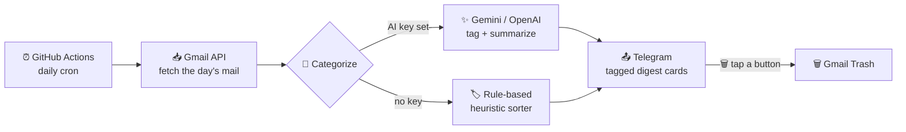

<div align="center">


<h3>Stop scrolling your inbox. Let a bot read it, sort it, and hand you the summary.</h3>

<p><strong>Lazy Me</strong> reads your Gmail, tags every email into clean categories, and delivers a tidy digest straight to Telegram — where one tap can trash a whole category. Self-hosted, runs itself on a schedule, and <strong>works for free with zero AI keys.</strong></p>

<p>
<a href="#-quick-start"><b>Quick Start</b></a> ·
<a href="#-how-it-works"><b>How it works</b></a> ·
<a href="#-features"><b>Features</b></a> ·
<a href="#-configuration"><b>Configuration</b></a> ·
<a href="#-roadmap"><b>Roadmap</b></a>
</p>

<p>
<a href="https://github.com/J-anubhav/Laze-Me/actions/workflows/tests.yml"></a>


</p>

</div>

---

## 🌟 Why Lazy Me

Your inbox is a firehose — rejections, recruiter spam, job alerts, bills, newsletters — and you scroll all of it to find the two that matter. **Lazy Me does the reading for you.**

- 📬 **One digest, not 40 emails.** A clean per-category summary lands in Telegram once a day.
- 🏷️ **Tagged and tappable.** Every category is a `#hashtag` you can filter in Telegram — and one button trashes the whole tag.
- 🆓 **Free by default.** A built-in rule-based sorter means **no OpenAI/Gemini key needed.** Add one only if you want AI-written summaries.
- 🔒 **Trash, never delete.** Gmail access is capped at `gmail.modify` — mail moves to Trash (recoverable ~30 days) and can never be permanently deleted.
- ☁️ **Runs itself.** GitHub Actions cron fires it daily — your PC can be off.
- 🧩 **Yours to bend.** Categories, sorting rules, timezone, and schedule are all a few lines of config.

> **The pitch in one line:** it's the inbox-zero assistant that texts you the summary and never asks for a subscription.

---

## ✨ Features

| | Feature | What you get |
|---|---|---|
| 📥 | **Gmail fetch** | Pulls any day's mail via the official Gmail API (OAuth, no password stored). |
| 🧠 | **Smart categorize** | 9 built-in buckets — rejections, interviews, applications, job alerts, finance, promos, personal, newsletters, other. |
| 🆓 | **Zero-key mode** | Rule-based heuristic sorts mail with **no AI key**. Optional Gemini/OpenAI upgrade for AI summaries. |
| 📤 | **Telegram delivery** | A header card + one message per category, showing sender name **and** real address so spoofing is visible. |
| 🏷️ | **Tag filtering** | Each card ends in a `#hashtag` — tap in Telegram to see that category across all days. |
| 🗑️ | **Trash by tag** | A **🗑 Trash all #Tag** button moves the whole category to Gmail Trash (recoverable ~30 days). |
| 📅 | **Any date** | `--date today \| yesterday \| YYYY-MM-DD` — re-run a digest for any day. |
| ⏰ | **Scheduled** | Ships with a GitHub Actions cron; also runs locally or on demand. |

---

## 🔧 How it works



**The pipeline:** fetch → categorize → deliver. Categorization tries your AI provider if a key is present, and cleanly falls back to the free heuristic if not (or if the API is rate-limited) — so a digest **always** goes out. An optional listener bot turns the trash buttons into real Gmail actions.

---

## 🚀 Quick Start

> **Prerequisites:** Python 3.9+, a Google account, and a Telegram account.

```bash
# 1. Clone
git clone https://github.com/J-anubhav/Laze-Me.git
cd Laze-Me

# 2. Install
python -m venv .venv && . .venv/Scripts/activate   # macOS/Linux: source .venv/bin/activate
pip install -r requirements.txt

# 3. Configure
cp .env.example .env        # then fill in the values (see below)

# 4. Authorize Gmail (one-time, opens a browser, writes token to .env)
python auth_setup.py

# 5. Try it — prints the digest, sends nothing
python src/main.py --dry-run

# 6. For real — sends to your Telegram
python src/main.py
```

<details>
<summary><b>🔑 Getting your keys (click to expand)</b></summary>

<br>

**Gmail (required)**
1. [Google Cloud Console](https://console.cloud.google.com/) → new project → **enable the Gmail API**.
2. **OAuth consent screen** → *External* → add your own email as a **Test user**.
3. **Credentials → Create OAuth client ID → Desktop app** → download JSON as `credentials.json` in the repo root.
4. Run `python auth_setup.py` — approve access, and the refresh token is written to `.env` for you.

**Telegram (required)**
1. Message [@BotFather](https://t.me/BotFather) → `/newbot` → copy the **bot token**.
2. Send any message to your new bot, then message [@userinfobot](https://t.me/userinfobot) to get your numeric **chat id**.

**AI provider (optional — skip for free heuristic mode)**
- Gemini: [aistudio.google.com/apikey](https://aistudio.google.com/apikey) · OpenAI: [platform.openai.com/api-keys](https://platform.openai.com/api-keys)

</details>

---

## 🕹️ Usage

```bash
python src/main.py                     # today's mail → Telegram
python src/main.py --dry-run           # today, print only (nothing sent)
python src/main.py --date yesterday    # yesterday's mail
python src/main.py --date 2026-07-10    # a specific day (YYYY-MM-DD)
python src/bot.py                      # start the listener so 🗑 trash buttons work
```

### Trash a whole category from Telegram
Run `python src/bot.py` alongside your digests. Each category card shows a **🗑 Trash all #Tag** button — tapping it moves that category's mail to Gmail Trash and updates the card. Requires the `gmail.modify` scope (re-run `auth_setup.py` to upgrade from read-only).

---

## ⚙️ Configuration

All settings live in `.env` (copy from [`.env.example`](.env.example)):

| Variable | Required | Description |
|---|:---:|---|
| `GMAIL_CLIENT_ID` / `GMAIL_CLIENT_SECRET` / `GMAIL_REFRESH_TOKEN` | ✅ | Written automatically by `auth_setup.py`. |
| `TELEGRAM_BOT_TOKEN` / `TELEGRAM_CHAT_ID` | ✅ | Your bot token and chat id. |
| `GEMINI_API_KEY` / `GEMINI_MODEL` | ⬜ | Optional — enables AI summaries. Defaults to **`gemma-4-31b-it`**, which is **free of charge** on the Gemini API. Omit the key entirely for the free heuristic mode. |
| `DIGEST_TIMEZONE` | ⬜ | IANA tz for the "day" window. Default `Asia/Kolkata`. |
| `BODY_TRUNCATE` | ⬜ | Max chars of body sent to the LLM. Default `500`. |
| `SEND_ON_EMPTY` | ⬜ | Send a "no mail today" note on empty days. Default `true`. |

**Customize the buckets:** edit `CATEGORY_META` in [`src/config.py`](src/config.py) (name, emoji, hashtag).
**Customize the free sorter:** edit `heuristic()` in [`src/categorize.py`](src/categorize.py).

### Deploy the daily cron (GitHub Actions)
1. Push the repo to GitHub.
2. **Settings → Secrets and variables → Actions** → add each variable above as a repository secret.
3. **Actions → Daily Gmail Digest → Run workflow** to test, then it runs daily on the cron in [`.github/workflows/digest.yml`](.github/workflows/digest.yml).

---

## 🗺️ Roadmap

- [x] Gmail → categorize → Telegram digest
- [x] Free rule-based sorter (no AI key)
- [x] `#hashtag` tags + tap-to-filter
- [x] Trash-by-tag buttons
- [x] Any-date digests + daily GitHub Actions cron
- [ ] **Always-on webhook bot** (trash buttons work with your PC off)
- [ ] More actions: archive / mark-read / label by tag
- [ ] Discord & WhatsApp delivery channels
- [ ] Weekly / custom schedules and per-category quiet hours

---

## 🤝 Contributing

Contributions are welcome — new category rules, delivery channels, bug fixes, docs.

**Start here: [CONTRIBUTING.md](CONTRIBUTING.md)** for setup, testing, and the PR
process. Also see the [Code of Conduct](CODE_OF_CONDUCT.md).

```bash
# Fork, clone, then:
pip install -r requirements.txt
python -m unittest discover tests -v    # no credentials needed — all mocked
```

Good first contributions: add heuristic rules for senders your inbox sees, add a
new `CATEGORY_META` bucket, or improve digest formatting. Look for issues
labelled [`good first issue`](https://github.com/J-anubhav/Laze-Me/labels/good%20first%20issue).

Every PR runs the test suite on Python 3.9 and 3.12. `main` is protected —
all changes go through a reviewed pull request.

---

## 🔐 Security & privacy

- Gmail scope is capped at **`gmail.modify`** — enough to move mail to Trash
  (recoverable ~30 days), never enough to permanently delete or touch account settings.
- All secrets stay in `.env` (git-ignored) or GitHub Actions secrets — nothing is committed.
- Digests show the sender's **real email address** alongside the display name, so a
  spoofed "Google Security" can't hide behind a friendly name.
- Email content is treated as **untrusted input** to the AI classifier, and the
  catch-all `Other/Important` category never gets a bulk-trash button.
- Trash buttons are single-use, expire after 3 days, and only respond to your own
  Telegram user id.

Found a vulnerability? Please report it privately — see [SECURITY.md](SECURITY.md).

---

## 📄 License

[MIT](LICENSE) © 2026 [J-anubhav](https://github.com/J-anubhav) — free to use, fork, and modify.

<div align="center">
<br>
<strong>If Lazy Me saves you from your inbox, give it a ⭐ — it helps others find it.</strong>
<br><br>
<a href="https://github.com/J-anubhav/Laze-Me">

</a>
</div>
